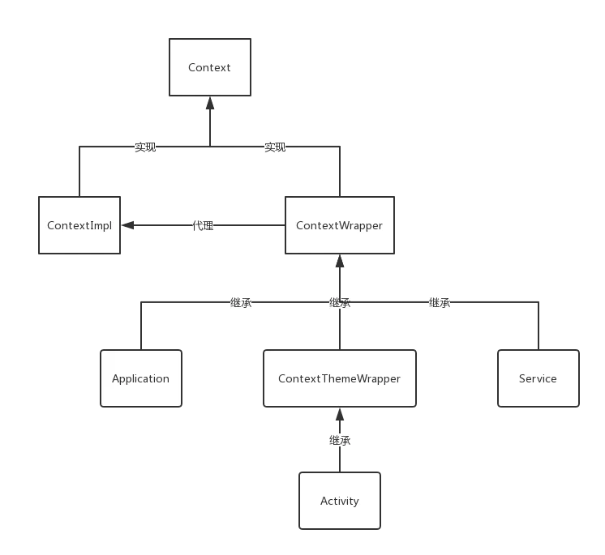
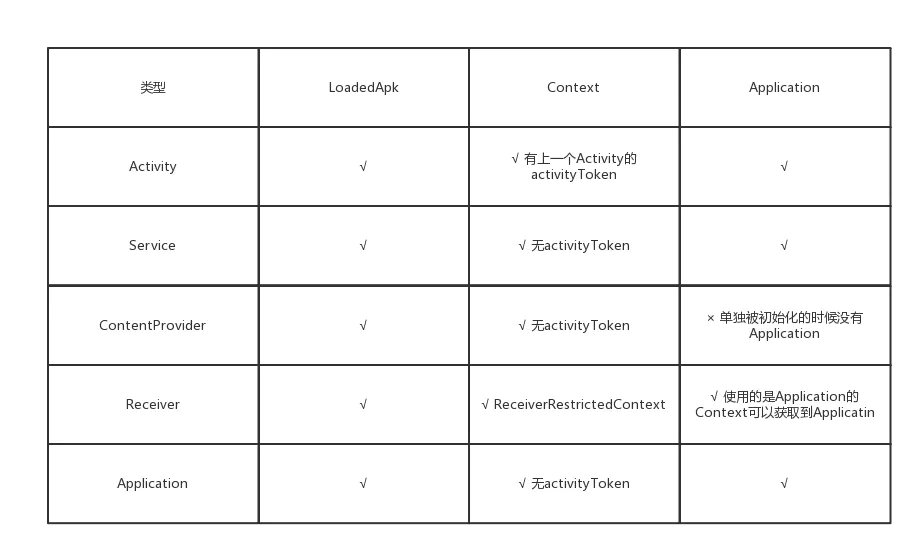
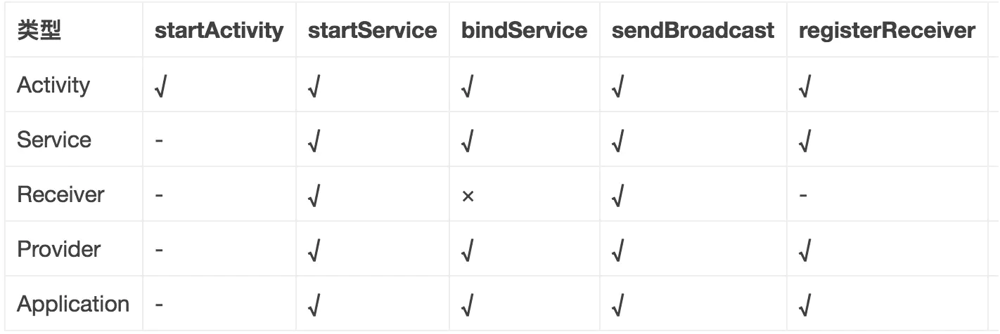

# 四大组件以及Application和Context的全面理解

## 一、概述

### 阅读须知

- 1.文章中的缩写指代的意思：
  - CI——>ContextImpl、
  - AT——>ActivityThread、
  - LA——>LoadedApk、
  - CR——>ContentResolver、
  - PM——>PackageManager、
  - SP——>SharedPreferences、
  - APT——>ApplicationThread、
  - AMS——>ActivityManagerService、
  - PR——>ProcessRecord、
  - AR——>ActivityRecord、
  - AS——>ActiveServices、
  - SR——>ServicecRecord。
- 2.文章中的变量 mXXX(yyy)，括号中 yyy 表示该变量的类型。
- 3.文章中的方法 xxx(yyy)，括号中 yyy 表示方法需要传入的变量类型。

##二、用处
- 1.Context的实现类有很多，但是 `ContextImpl` 是唯一做具体工作的，其他实现都是对 `ContextImpl` 做代理。
- 2.`ContextImpl` 中有一些成员对象，先来看看这些对象的用处：
  - 1.mSharedPrefsPaths、sSharedPrefsCache：这两个对象是用于获取 SharedPreferences 的，在我前一篇博客里面有讲到。全面剖析SharedPreferences。
  - 2.mMainThread(`ActivityThread`)：这个对象是一个 App 进程的主线程，一个 App 的 Framework 层就是从这里启动的。
  - 3.mPackageInfo(`LoadedApk`)：在 `ActivityThread` 初始化 App 的主线程的时候，会将 Apk 加载到内存中，Apk 在内存中就是以这个对象的形式存在的，该对象可以加载 Apk 的资源和 Dex 文件。
  - 4.mUser(UserHandle)：多用户相关。
  - 5.mContentResolver( ApplicationContentResolver)：继承于 `ContentResolver`，主要功能是通过 Uri 来获取文件、数据库、Asset、Res 等数据，还有就是通过 ContentProvider 来获取其他应用和本机数据。
  - 6.mResourcesManager(ResourcesManager)：单例，因为一个 Apk 不同机型的适配资源，所以用来加载Resource对象，以保证一个 App 中所有的 `ContextImpl` 使用的都是同一份资源。
  - 7.mResources(Resources)：获取 Apk 中 Res 资源的对象。
  - 8.mOuterContext(Context)：用于指向代理本对象的 Context，例如 Activity、Service 等。
  - 9.mTheme(Resources.Theme)：主题
  - 10.mPackageManager(`PackageManageresolver`)：包管理类，不仅可以获取我们apk包的信息，还能获取本机apk包的信息。
- 3.`ContextImpl` 中有很多 Api，我将这些 Api 归了一下类
  - 1.获取成员对象：即获取上面我列出来的那些对象，这些对象获取到了之后又有更多 Api 暴露出来，在这里 `ContextImpl` 相当于做了一个聚合。最常用的就是 getResource() 了。
  - 2.获取成员对象的成员对象：即为了方便，`ContextImpl` 封装了一些常用的获取成员对象中的信息的方法。例如getPackageName()，是通过 `PackageManageresolver` 来获取的。
  - 3.关于 `SharedPreferences` 的操作：我们知道 `SharedPreferences` 其实就是 Xml 文件，所以这里的操作有：获取、移动、删除。
  - 4.文件操作：增删移文件、打开文件流、获取 App 私有文件夹地址等等。
  - 5.数据库操作：我们知道 Sqlite 其实是一种文件型数据库，所以有：打开、创建、移动、删除、获取数据库文件路径，等操作。
  - 6.壁纸相关操作：这个不是成员变量提供的，WallpaperManager 是系统 Service 一种，所以是SystemService 提供的。
  - 7.启动Activity：包括一般启动 Acitivyt、多用户启动 Activity、启动多个 Activity。
  - 8.广播操作：发送普通广播、发送需要权限的广播、发送有序广播、发送粘连广播、发送有序粘连广播、多用户广播、移除各种广播、注册各种广播、取消注册各种广播。
  - 9.Service 操作：启动、停止、重启、绑定、解绑、获取系统服务以及多用户操作。
  - 10.权限操作：检查本 App 是否有某种权限、检查某 App 是否有某种权限、检查Uri权限、授予权限等等。
  - 11.各种情况下创建 `ContextImpl`，这个比较重要：
    - 1.createSystemContext(`ActivityThread`)：在 SystemService 创建的时候为其创建一个 `ContextImpl`
    - 2.create App Context(`ActivityThread`，`LoadedApk`)：在 App lication/Service创建的时候为其创建一个 `ContextImpl`
    - 3.createActivityContext(ActivityThread mainThread，`LoadedApk`， IBinder， int displayId，Configuration)：在 Activity 创建的时候为其创建一个 `ContextImpl`。
## 三、四大组件以及 App lication初始化与Context的关系
> 在了解 Binder 的时候有如下要注意的点

图片
### 1.Activity初始化
- 1.`ContextImpl`.startActivity()：将调用交给 Instrumentation (负责监控 Activity 和 `ActivityManagerService` 的交互，所有 Activity 的本地进程到远端进程的调用转换都是其来执行)，

- 2.Instrumentation.execStartActivity()：传入一个 `ApplicationThread` 然后通过 Binder 机制将调用过程转移到(后称AMS)所AMS 在的系统服务进程，本地主线程则继续运行，不过本地主线程后续也没别的操作了。接下来就是本地的MessageQueue 等待 `ActivityManagerService` 服务运行完毕，发送消息将 Activity 的启动重新交给本地主线程。

- 3.`ActivityManagerService`.startActivity()：从这里开始会调用会按顺序在 ActivityStarter、ActivityStackSupervisor、ActivityStack 这三个类之间进行调用，主要会进行下面这些操作，不按顺序：

  - 1.对 Intent 的内容进行解析，获取目标 Activity 的信息。
  - 2.根据传入的 `ApplicationThread` 获取被调用 App 的信息封装成 `ProcessRecord`。
  - 3.将1、2和其他信息结合，将源 Activity 和目标 Activity 封装成两个 `ActivityRecord`
  - 4.解析 Activity 的启动模式 和当前的 Activity 栈状态，判断是否需要创建栈和 Activity 。(注意这里的AR 有着 App 中的 Activity 的全部信息，可以将其看成系统服务里面的 Activity 的化身)
  - 5.获取到 Activity 和 Activity 栈之后，接下来要判断是否要将当前 Activity 执行 onPause() 以及让使用Binder 执行目标 Activity 的 onCreate() 和 onResume(注意这里 onStart() 会在 Binder 远程调用onCreate() 的时候直接执行)，这里 `ActivityManagerService` 进程会使用 `ApplicationThread` 调用 App 进程的 Activity 执行相应的生命周期。
  - 6.在 `ActivityManagerService` 中前置准备一切就绪之后，会通过 `ApplicationThread` 使用 Handler 的形式调用到 App 进程的 `ActivityThread` 中。
  - 7.最终到了ActivityStackSupervisor.realStartActivityLocked()中会使用 `ApplicationThread` 将调用交给 App 进程——>`ActivityThread`.scheduleLaunchActivity()——>`ActivityThread`.handleLaunchActivity()
- 4.`ActivityThread`.handleLaunchActivity()：将有以下操作

  - 1.`ActivityThread`.performLaunchActivity：这个方法有以下操作
    - 1.创建对象LA(一个 App 只加载一次)
    - 2.创建对象 Activity
    - 3.创建对象 App lication(一个 App ，只创建一次)
    - 4.**创建对象 `ContextImpl` **：`ContextImpl`.createActivityContext()
    - 5.Application、CI都 attach 到 Activity 对象：Activity.attach()
    - 6.执行 onCreate()：Instrumentation.callActivityOnCreate()——>Activity.performCreate()——>Activity.onCreate()
    - 7.执行onStart()：`ActivityThread`.performLaunchActivity——>Activity.performStart()——>Instrumentation.callActivityOnStart()——>Activity.onStart()
  - 2.`ActivityThread`.handleResumeActivity()
    - 1.`ActivityThread`.performResumeActivity()——>Activity.performResume()——>Instrumentation.callActivityOnResume()——>Activity.onResume()
    - 2.Activity.makeVisible()——>WindowManager.addView()：开始进行View的绘制流程。
    - 3.从上面我们可以总结一下：在 `ActivityManagerService` 将调用交给 App 进程之后，三个生命周期都是在 App 进程被回调的，并且在 onResume() 之后View才进行绘制
### 2.Service初始化
  - 1.`ContextImpl`.startService()——>`ContextImpl`.startServiceCommon()：在这里传入一个 `ApplicationThread`，类似 Activity 启动时的第二步，将调用过程转移到 `ActivityManagerService` 中，本地主线程继续运行，等待 `ApplicationThread` 从 `ActivityManagerService` 进程将调用转移到本地主线程中。
  - 2.`ActivityManagerService`.startService()：到了 `ActivityManagerService` 进程之后，Service 的启动就会全权交给 `ActiveServices`(这是 `ActivityManagerService` 用来管理 Service 的成员变量)
  - 3.`ActiveServices`.startServiceLocked()：这里做了以下操作
    - 1.根据传入的 `ApplicationThread` 获取被调用 App 的信息封装成 `ProcessRecord`
    - 2.解析 Intent 等参数获取到 Service 的信息，封装成 `ServiceRecord`(这个类可以看做是 Service 在系统服务的化身，记录了 Service 的一切信息)
    - 3.再进过一系列调用：`ActiveServices`.startServiceInnerLocked()——>`ActiveServices`.bringUpServiceLocked()——>`ActiveServices`.realStartServiceLocked() 到这里才是真正在 App 进程启动 Service 的流程。
  - 4.`ActiveServices`.realStartServiceLocked()：这里会有以下操作：
    - 1.`ServiceRecord`.`ApplicationThread`.scheduleCreateService()：这里会将调用转到 App 进程，但是当前的进程还会继续执行，这里就到了 App 线程的APT，这个方法里有以下操作
      - 1.通过 Handler 转到 `ActivityThread`.handleCreateService()
      - 2.创建对象 `LoadedApk`(一个 App 只加载一次)
      - 3.创建对象 Service
      - 4.创建对象 `ContextImpl`
      - 5.创建对象 Application(一个 App 只创建一次)
      - 6.Application、CI分别 attach 到 Service 对象
      - 7.执行 Service.onCreate() 回调
      - 8.此时 Service 已经启动了
    - 2.`ActiveServices`.sendServiceArgsLocked()——>`ServiceRecord`. App.`ApplicationThread`.scheduleServiceArgs()：这里就转到了 App 进程的 `ApplicationThread` 中，这里会有以下操作：
      - 1.`ApplicationThread`.scheduleServiceArgs()
      - 2.`ActivityThread`.handleServiceArgs()
      - 3.Service.onStartCommand()
      - 4.此时我们需要在 Service 中进行的操作将会执行。
    - 3.ContentProvider初始化
      - 1.`ActivityThread`.main()——>`ActivityThread`.attach()——>`ActivityManagerService`.attach App lication()：传入一个 `ApplicationThread`，调用转到了 `ActivityManagerService` 进程
      - 2.`ActivityManagerService`.attachApplicationLocked()：获取到 ApplicationInfo 和 ProviderInfo 列表之后通过 `ApplicationThread` 将调用转回 App 进程。
      - 3.`ApplicationThread`.bindApplication()——>`ActivityThread`.handleBindApplication()——>`ActivityThread`.installContentProviders()：到这里之后将会循环初始化 ContentProvider。
    - 4.`ActivityThread`.installProvider()：这个方法里面有以下操作
      - 1.创建对象LA：`ContextImpl`.createPackageContext()中
      - 2.创建对象CI：`ContextImpl`.createPackageContext()中
      - 3.创建对象ContentProvider：ClassLoader创建
      - 4.`ContextImpl` attach到ContentProvider对象：ContentProvider.attachInfo()中
      - 5.执行onCreate回调：ContentProvider.attachInfo()中
### 4.BroadCastReceiver静态初始化
  > 因为动态广播的注册时进程已创建， 基本对象已创建完成，只需要回调BroadcastReceiver 的 onReceive() 方法即可，所以这里不分析

- 1.当收到广播时会调用AT.handleReceiver()

- 2.创建对象LA(一个 App 只加载一次)

- 3.创建对象BroadcastReceiver

- 4.创建对象 Application

- 5.从创建的 Application中获取 `ContextImpl`

- 6.执行 onReceive() 回调

### 5.Application初始化：由上面四个组件的初始化我们可以知道，当 App 还没启动的时候唤醒任意组件都会创建一个 Application，而这里分析的是正常情况启动一个 App 的时候创建 Application的流程。

- 1.这里的流程其实就是包含了ContentProvider 初始化的流程，所以前面都差不多
- 2.最后到了AT.handleBindApplication()中，这里有以下操作：
  - 1.创建对象 `LoadedApk`
  - 2.创建对象 `ContextImpl`
  - 3.创建对象 Instrumentation
  - 4.创建对象 Application;
  - 5.安装 providers
  - 6.执行 Create 回调
##四、四大组件以及 App lication绑定Context的方法
  > 由上一节我们可以知道，四大组件以及 App lication在初始化的时候都会进行Context的绑定或者创建，这节就来讲讲各个组件是如何对context进程赋值的。

- 1.Activity：
  - 1.`ActivityThread`.performLaunchActivity()
  - 2.`ActivityThread`.createBaseContextForActivity(ActivityClientRecord ， Activity)
  - 3.`ContextImpl`.createActivityContext(ActivityThread ， LoadedApk ， IBinder ， int displayId ， Configuration)
  - 4.`ContextImpl`()：被赋值了 ActivityThread、LoadedApk、IBinder activityToken、Configuration
- 2.Service/ App lication：
  - 1.`ActivityThread`.handleCreateService()
  - 2.`ContextImpl`.create App Context(ActivityThread ， LoadedApk)
  - 3.new `ContextImpl`()：被赋值了 ActivityThread、LoadedApk
- 3.BroadCastReceiver：在AT.handleReceiver()中直接获取 App lication的Context，其自身并不创建Context
- 4.ContentProvider：
  - 1.`ActivityThread`.installProvider()
  - 2.Context.createPackageContext()——>`ContextImpl`.createPackageContext()——>`ContextImpl`.createPackageContextAsUser()：这里是通过一个 App lication的Context创建的Context，所以可以看做是 App lication的Context的一个复制。
## 五、总结
### 1.组件初始化会创建的对象

- 1.LoadedApk：所有组件在初始化的时候，如果LA没被初始化都会初始化一遍
- 2.Context：
  - 1.只有Activity的CI有上一个Activity的Token
  - 2.Receiver的Context是继承于ContextWr App er 的 ReceiverRestrictedContext，不可绑定Service。
- 3.App lication：
  - 1.Receiver使用的Context是ReceiverRestrictedContext包装的 App lication的Context，所以其可以通过Context获取到 App lication
  - 2.ContentProvider一般是在 App 初始化的时候在初始化 App lication的过程中加载的，此时 App lication会被加载。但是如果是多个 App 共享进程，第二个 App 由ContentProvider调起，那么 App lication不会被初始化。
### 2.Context使用场景
  
  说明： (图中第一列代表不同的 Context， √代表允许在该 Context 执行相应的操作; ×代表不允许; -代表分情况讨论)

- 1.当 Context 为 Receiver的情况下：
  - 1.不允许执行 bindService() 操作， 由于限制性上下文(ReceiverRestrictedContext)所决定的，会直接抛出异常.
  - 2.registerReceiver 是否允许取决于 receiver;
  - 3.当 receiver == null 用于获取 sticky 广播， 允许使用。否则不允许使用registerReceiver。
- 2.纵向来看 startActivity 操作
  - 1.当为 ActivityContext 则可直接使用;
  - 2.当为其他 Context， 要启动的 Activity 不属于任何 Activity 栈，所以必须带上 FLAG_ACTIVITY_NEW_TASK flags 才能使用
### 3.getApplication() 和 getApplicationContext()
> 绝大多数情况下， getApplication() 和 getApplicationContext() 这两个方法完全一致， 返回值也相同; 那么两者到底有什么区别呢? 真正理解这个问题的人非常少. 接下来彻底地回答下这个问题：

- 1.getApplicationContext() 这个的存在是 Android 历史原因. 我们都知道 getApplication() 只存在于 Activity 和Service 对象，那么对于 BroadcastReceiver 和 ContentProvider 却无法获取 Application， 这时就需要一个能在 Context 上下文直接使用的方法， 那便是 getApplicationContext().
- 2.对于 Activity/Service 来说， getApplication() 和 getApplicationContext() 的返回值完全相同，除非厂商修改过接口。
- 3.BroadcastReceiver 在 onReceive 的过程，能使用 getBaseContext().getApplicationContext 获取所在 App lication，而无法使用 getApplication;
- 4.ContentProvider 能使用 getContext().getApplicationContext() 获取所在 Application. 绝大多数情况下没有问题，但是有可能会出现空指针的问题。情况如下：当同一个进程有多个 Apk 的情况下， 对于第二个 Apk 是由Provider 方式拉起的， 前面介绍过 Provider 创建过程并不会初始化所在 Application， 此时执 getContext().get ApplicationContext() 返回的结果便是 NULL，所以对于这种情况要做好判空。
## 参考文章
- 1.[Context全面理解](http://gityuan.com/2017/04/09/android_context/)
不贩卖焦虑，也不标题党。分享一些这个世界上有意思的事情。题材包括且不限于：科幻、科学、科技、互联网、程序员、计算机编程。下面是我的微信公众号：世界上有意思的事，干货多多等你来看。

作者：何时夕
链接：https://www.jianshu.com/p/f499afd8d0ab
来源：简书
著作权归作者所有。商业转载请联系作者获得授权，非商业转载请注明出处。